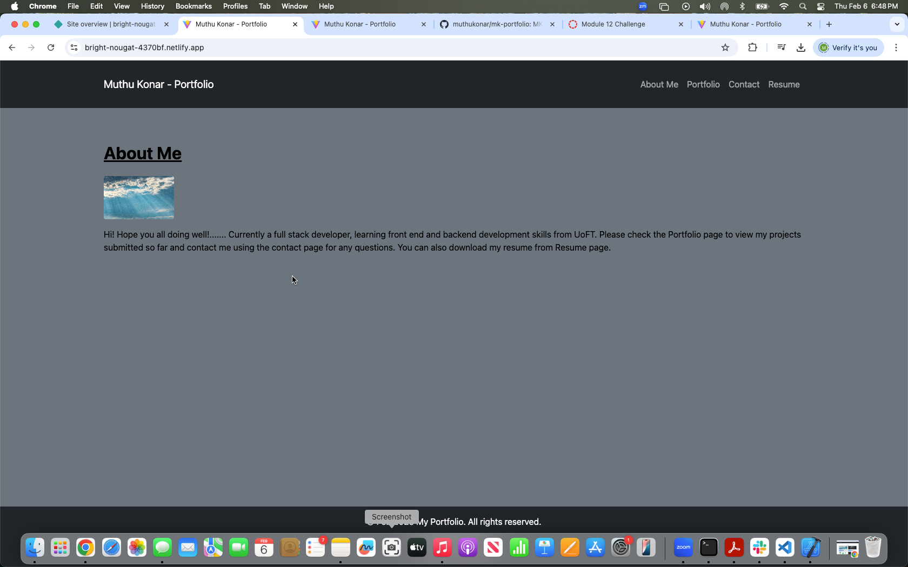

KoneTechI®  
  Feb, 2025
  
   
    
  # MK-Portfolio

  ## Description
  This project is about portfolio creation using the React skills learnt in Full Stack Development BootCamp at UoFT

  ## Table of Contents

  - [Installation](#installation)
  - [Usage](#usage)
  - [credits]()
  - [Contributing](#contributing)
  - [Tests](#tests)
  - [License](#license)
  - [Questions](#questions)

## Installation
      - Create Repository in Git
      - Clone it to local machine
      - npm create vite
      - npm install
      - npm run dev 

## Usage
execute npm run start from terminal. Once application is started click on the url to view my portfolio. The portfolio site contains details about me, my projects created in bootcamp and contact method on how to reach me for any questions and resume with a PDF download link

Deployed link : - https://bright-nougat-4370bf.netlify.app/ 

GitHub link :- https://github.com/muthukonar/mk-portfolio

Screenshots :

## Credits
Instructor and TA's

## Contributing
View my portfolio and contact me for any opportunities

 ## Tests
Browse through the portfolio page and suggest for any changes needed 

## License
This project is licensed under the MIT license.

## Questions
For any questions, please contact me at [pmkonar@gmail.com](mailto:pmkonar@gmail.com).
You can also find more of my work at [muthukonar](https://github.com/muthukonar).

'This document was last updated on Feb, 2025'
